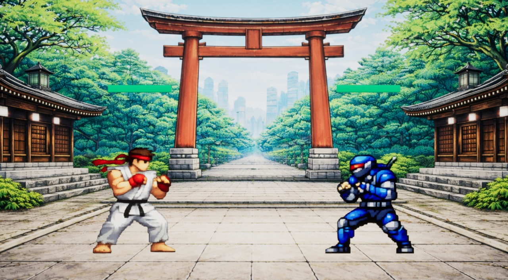

# Dojo Clash

**Dojo Clash** is a 2D fighting game prototype developed in **Unreal Engine** as part of a **Final Year Project (FYP)** at **Nanyang Technological University (NTU), Singapore**.

This repository contains a **Windows build** packaged as a zip file for easy download and execution.

## Download and Run (Windows)

1. Download the build zip:
   
   `releases/dojo_clash.zip`

2. Extract the zip to a folder (e.g., `C:\Games\DojoClash\`).

3. Run the game:
   
   `dojo_clash.exe`

> Important: Do **not** move the `.exe` out of the extracted folder. The game requires the accompanying folders (e.g., `Engine/`, `dojo_clash/`) to run properly.

## Notes

- Platform: Windows (64-bit)
- Built with: Unreal Engine (2D / Paper2D workflow)
- If Windows SmartScreen appears, select **More info** → **Run anyway**.

## Project Context

This build is provided for evaluation and demonstration purposes within the scope of the NTU FYP.

## License

This repository distributes a compiled build artifact only. All third-party assets (if any) remain the property of their respective owners.
